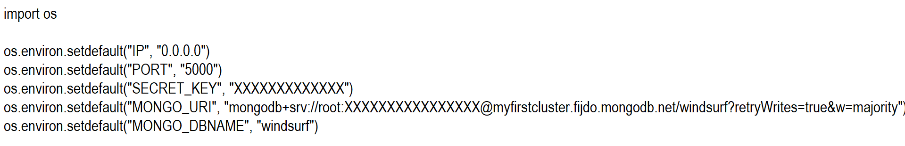

Surf Event planner - Milestone Project 3
======================================
**Surf Event Planner- Code Institute Milestone Project 3**

This [project](https://windsurf-event.herokuapp.com//) was designed and developed to be an online surf event planner for surfers. Users can plan and edit surf event registrations. 


The project needs to be able to demonstrate the use of CRUD functions:
```
1.  Create something
2.  Read something
3.  Update something
4.  Delete a something
```

Database Schema
-----------------------------------------
[MongoDB](https://www.mongodb.com/) was used to create the database for this website and it is hosted by [Atlas](https://www.mongodb.com/cloud/atlas).

Some of the queries were easy to forsee while some evolved over the development of the site. Original plans for the database schema can be [found here](https://github.com/deevdz/milestone-project-3/blob/master/planning/Online%20Cookbook%20Project%20-%20Initial%20Thoughts.pdf).

The final database schema consists of five collections which include recipes, users, allergens, recipeCategory and skillLevel. 


Final database schema diagrams can be found in the folder [Database Schema](https://github.com/deevdz/milestone-project-3/blob/master/planning/database_schema).

UX
-----------------------------------------
Documentation for the initial planning process can be [found here](https://github.com/deevdz/milestone-project-3/blob/master/planning/Online%20Cookbook%20Project%20-%20Initial%20Thoughts.pdf).

The wireframes for this site were generated using Adobe Illustrator. Wireframes for the site can be found in the folder [planning > wireframes](https://github.com/deevdz/milestone-project-3/tree/master/planning/wireframes)

After browsing through food blogs and recipe archives online the decision was made to use earthy tones. Colour Palette and final logo design can be [found here](https://github.com/deevdz/milestone-project-3/blob/master/planning/wireframes/colour-pallete-and-logo.png). I designed the logo in Adobe Photoshop.

Research was carried out on complimentary fonts and Libre Baskerville and Monsterrat were chosen for the site.

##### User Stories
  * As a user - I am immediately aware what the nature of the site is and its purpose
  * As a user - I can navigate through the surf event by various means i.e. Navigation dropdown
  * As a user - I can browse the site without being a logged in user
  * As a user - I can create a user profile, and log in and out
  * As a user - I can add, edit and delete my own surf events through my user account
  * As a user - I receive an error message if I am unable to login or register
  * As a user - I am able to access the site on mobile or tablet and have a similar experience as a desktop device
  * As a user - I register for a surf event
  * As a user - I am able to see all registerd surf event attendees
  * As a user - I am able to see the details for the registered event

Features
-----------------------------------------
##### Existing Features

The site can be used as a guest or as a logged in user, however, some features are only available to logged in users.

Any visitor to the site can view the registered surf events at the home page.

Visitors have the option of create an account. Information required to create an account is Username (which must be unique) and password. This information is stored in the users collection. The Username are stored as plain text but the password is stored in a hashed format.

When a visitor has created an account and logged in they are given the option to register for a surf event, Edit their own registered surf event, Delete their registered surf event from the database.

Adding a new surf event is only allowed by admin users.

A user has the option to edit or delete a surf event that they have added to the site only.

Technologies Used
-----------------------------------------
The website is designed using following technologies:

  * [HTML](https://en.wikipedia.org/wiki/HTML)
  * [CSS](https://en.wikipedia.org/wiki/CSS)
  * [JavaScript](https://en.wikipedia.org/wiki/JavaScript)
  * [Python](https://www.python.org/)
  * [Mongodb](https://www.mongodb.com/)
  * [Jquery](https://code.jquery.com/jquery-3.5.1.js)
  * [Font Awesome library](https://fontawesome.com/)
  * [Materializecss](http://https://materializecss.com/)
  * [dnspython 2.0.0](https://pypi.org/project/dnspython/)
  * [Flask 1.1.2](https://pypi.org/project/Flask/)
  * [Flask_PyMongo 2.3.0](https://pypi.org/project/Flask-PyMongo/)
  * [itsdangerous 1.1.0](https://pypi.org/project/itsdangerous/)
  * [pymongo 3.11.0](https://pypi.org/project/pymongo/)
  * [Werkzeug 1.0.1](https://pypi.org/project/Werkzeug/)


Testing
-----------------------------------------
**Testing:**
Tests were established to verify writing to the database and removing from the database i.e. Adding a user to the database.
Also adding, deleting and editing surf events by admin users. Adding, deleting, editing registered surf events from the database as a registered user.

**Responsiveness Testing:**
Aandroid mobile phone and Apple tablet were used to test the appearance of website on mobile/tablet screen size. 
Also the Google Chrome developer tool where used to test the mobile appearance of the website on different devices. 
   
**User Testing:**

Manual tests were carried out and the testing process was as follows:

**Homepage**
 + Click on logo or Home and verify that home page appears.
 + See the on registered events and the pull down menu for the details of the participant of the registered event
 + If visitor is not logged in “Login” should be displayed in the navigation and clicking this link will bring you to the login page.
 + If visitor is logged in the navigation should have Home, Profile, Plan Event and Log Out. 
 + If visitor is logged in you see a "edit"button for editing your own registered event
 + If visitor is logged you see a "edit"button for editing your own registered event
 + If visitor is logged you see a in the pull down menu the details of the participant of the registered event you will see email,gender,birthday, comment username.
 + If visitor is logged you see a in the pull down menu the details of the participant of the registered event you have the option to cencel the event.
 + Ensure slider displaying correct recipes, links to recipes going to correct pages and arrows on slider working.
 + Confirmed that the social links in the footer open in a new browser window and go to the correct links

**Profile**

 + Confirmed that you see the correct username
 + If visitor is logged in the navigation should have Home, Profile, Plan Event and Log Out
 + Confirmed that you see the windsurfing picture
 + Confirmed that the social links in the footer open in a new browser window and go to the correct links
 
 
**Plan Event**
 + Confirmed that you see the option to plan an event
 + Confirmed that you see an event pull down menu where you can choose your event
 + Confirmed that you see an option to register your name
 + Confirmed that you see an option to register your email address
 + Confirmed that you see radio buttons to select your male of female gender
 + Confirmed that you see a birthday picker to select your birthday
 + Confirmed that you see a comment field to give comment

**User Account**

###### Register Page
+ Confirmed that clicking on the sign up link brings the user to the registration page
+ All fields are required on the registration form
+ Tested registering successfully and was returned to the homepage as a logged in user with a welcome message.
+ Confirmed that username must be unique

###### Login Page
+ Confirm that the login link brings the user to the login page
+ If user enters an incorrect username then they will receive a error message.
+ If user enters a correct username but an incorrect password they will receive a message that you need a give in your password.
+ If the user enters the correct login details they are brought to the profile page with a welcome message. You see welcome "username" Navigation changes with the option Logout.

###### Logout
+ Verified that the user is returned to the login page and logged out of the system. 

Deployment
-----------------------------------------
Deployment and source control was carried out via GitHub and Heroku. The repository location is as follows:[https://github.com/remcokes/windsurf_event/](https://github.com/remcokes/windsurf_event/)

Heroku App Location is as follows [http://windsurf-event.herokuapp.com/](http://windsurf-event.herokuapp.com/)

Following steps were taken to deploy the website:
- Database and Tables were created in an Atlas MongoDB 
- Project workspace was created in GitHub. 
- In the GitHub workspace i make the env.py file to make a secure environment.
- 

4. Flask was installed - `sudo pip install flask`.
3. Setup app.py file and imported flask and os - `from flask import Flask. import os`
4. Created an instance of flask - `app = flask(__name__)`
5. Tested the connection as proof of concept. `CLI - show collections` (prove connection)
6. Inside the app run() function set the host, ip and debug=true
7. Create a new Heroku App - unique name and EU Server
8. In cloud 9 login to Heroku through CLI to confirm existance of app. `CLI: heroku login. CLI: heroku apps`.
9. Create a git repository in cloud9. CLI: git init. `CLI: git add . CLI: git commit -m "Initial Commit"`
10. Connect cloud9 to Heroku. Use code found on Heroku. `CLI - $heroku git remote -a deevdz-milestone-3`
11. Create requirements.txt file - `CLI: sudo pip3 freeze --local > requirements.txt`
12. Create Procfile - `echo web:python app.py>Procfile`
13. Add and Commit to Git Repository
14. Push to Heroku using code supplied by Heroku
15. `CLI - heroku ps:scale web=1` Command to tell Heroku to run the app
16. Login to Heroku to add config variables including IP, Port, Mongo_DB and Mongo_URI
17. Get Flask to talk to MongoDB - `CLI: sudo pip3 install flask-pymongo` `CLI: sudo pip3 install dnspython`
18. Add extra libraries to app.py - `from flask_pymongo import Pymongo` `from bson.objectid import ObjectID`
19. Add DB connection code to app.py - edit bashrc file to keep details private.
20. Test connection to DB again to confirm it's working
21. Confirm that the cloud9 runner is set to python 3
22. Connect GitHub repository to Heroku.
23. Set Debug to False

**Contact**

Created by [Remco Kes](mailto:rkes@stadgenoot.nl).
