# Surf Event planner - Milestone Project 3

This [project](https://windsurf-event.herokuapp.com//) was designed and developed to be an online surf event planner for surfers. Users can create, read, update and delete there registration to one of the surf events.

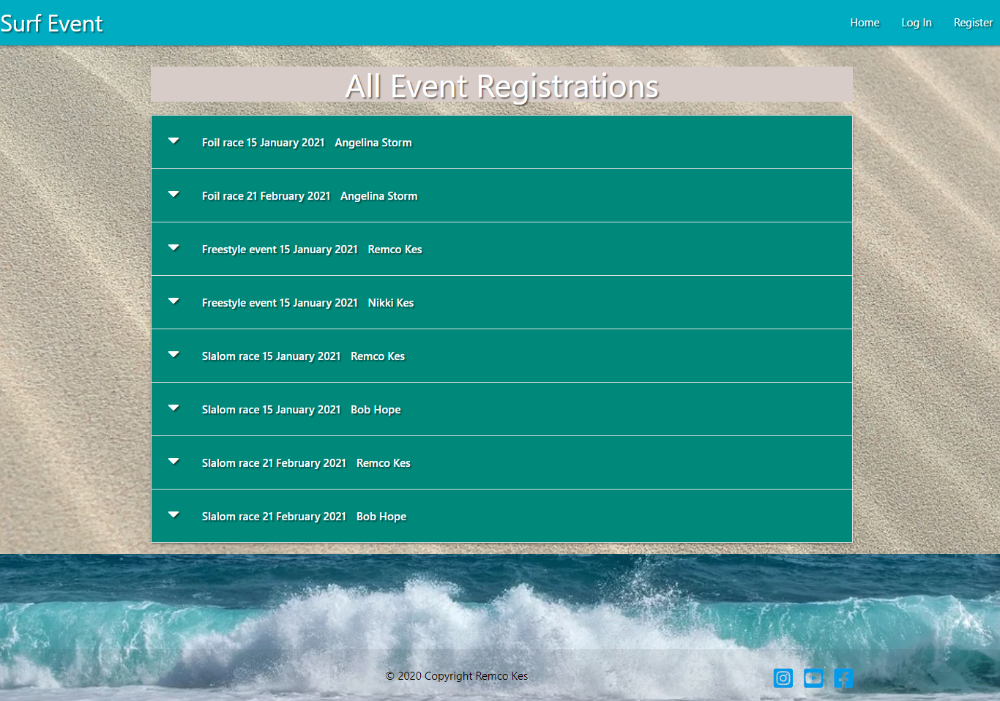

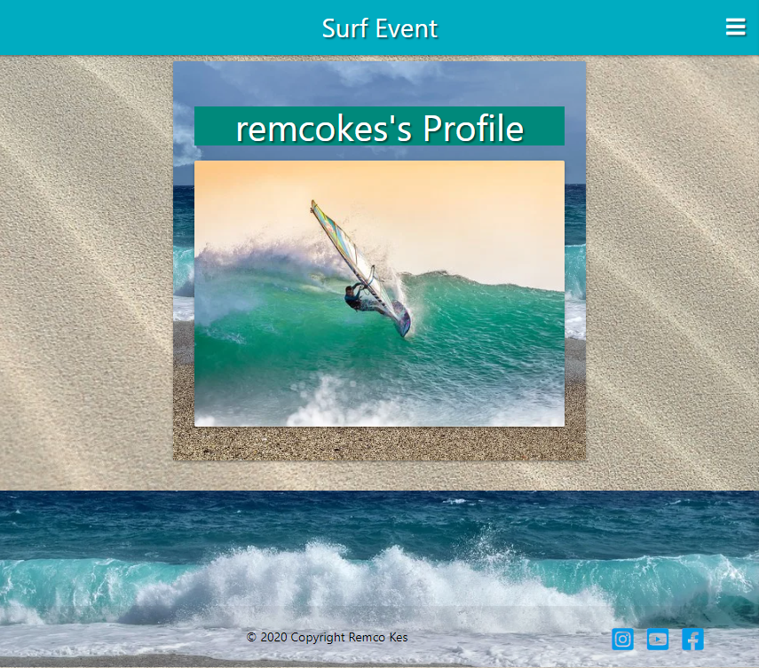

The project needs to be able to demonstrate the use of CRUD functions:
```
1.  Create something
2.  Read something
3.  Update something
4.  Delete a something
```
UX
-----------------------------------------

##### User Stories
  * As a user - I am immediately aware what the nature of the site is and its purpose
  * As a user - I can browse the site without being a logged in user
  * As a user - I can create a user profile, and log in and out
  * As a user - I can add, edit and delete my own surf event registrations through my user account
  * As a user - I receive an error message if I am unable to login or register
  * As a user - I am able to access the site on mobile or tablet and have a similar experience as a desktop device
  * As a user - I register for a surf event
  * As a user - I am able to see all registered surf event attendees
  * As a user - I am able to see the details for the registered events


##### Strategy
This website is for planning a surf event. After you register (create) for a event you can read, update and delete your own registration.
Only the admin can add (create), edit and delete events.
 
##### Structure

The wireframes for the site:

__Large__ <br>
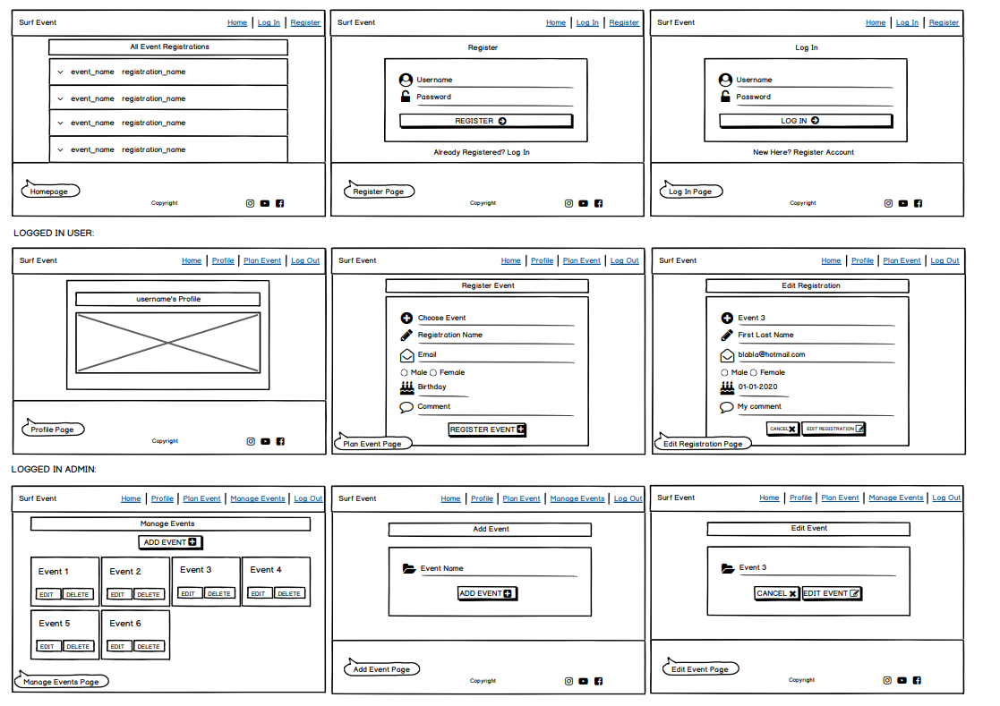

__Medium__ <br>
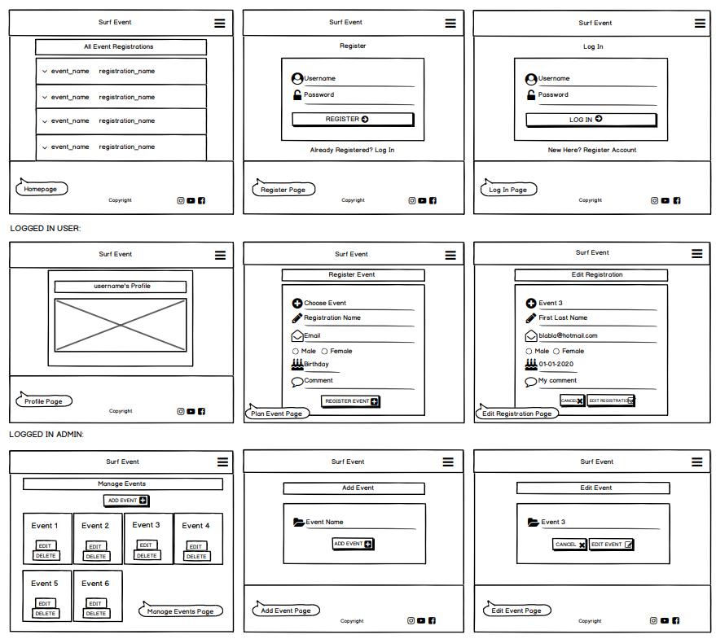

__Small__ <br>
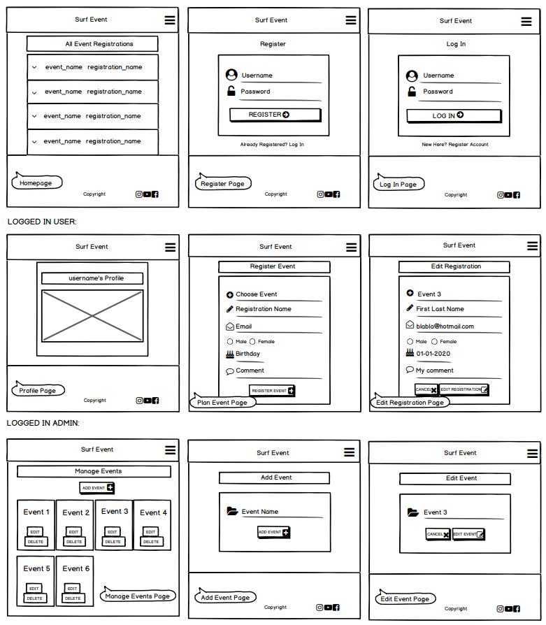

__Interactive__ <br>
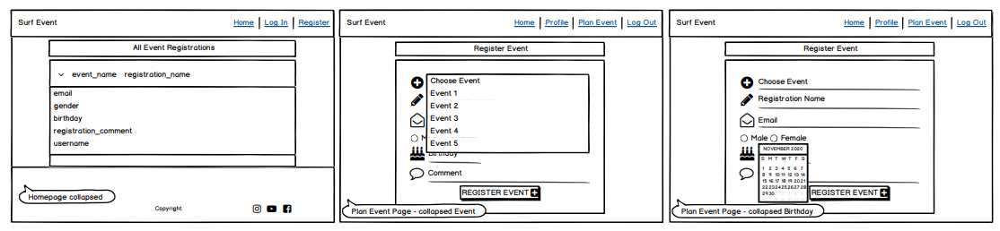

#### Website Explanation

Visitors can see the registered events


If users what to plan a event they must register (create an account).


The next time you visit the website you can enter your details into the log in page.

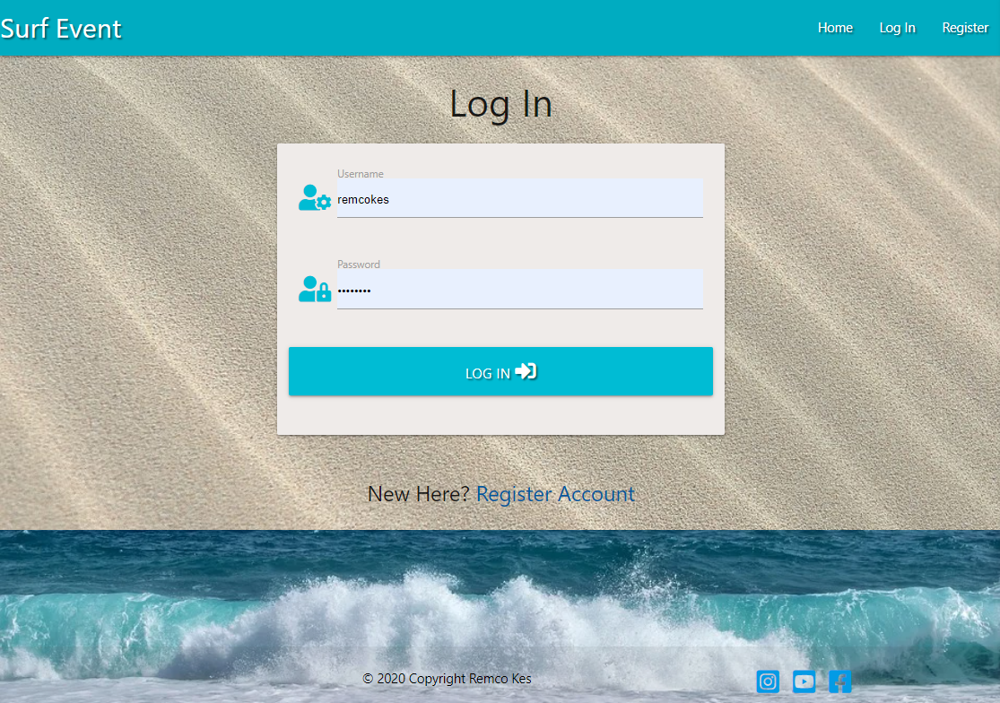

Now you can plan a surf event.

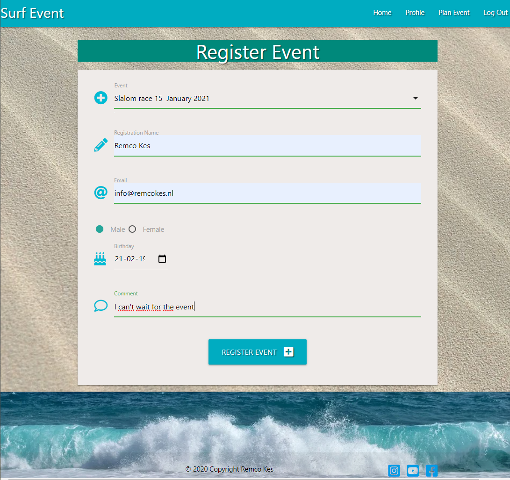

After you plan a event you can edit or cancel your own registration.
It's not possible to delete registrations from other users.


The admin account has has an extra option in the navbar: Manage Events.

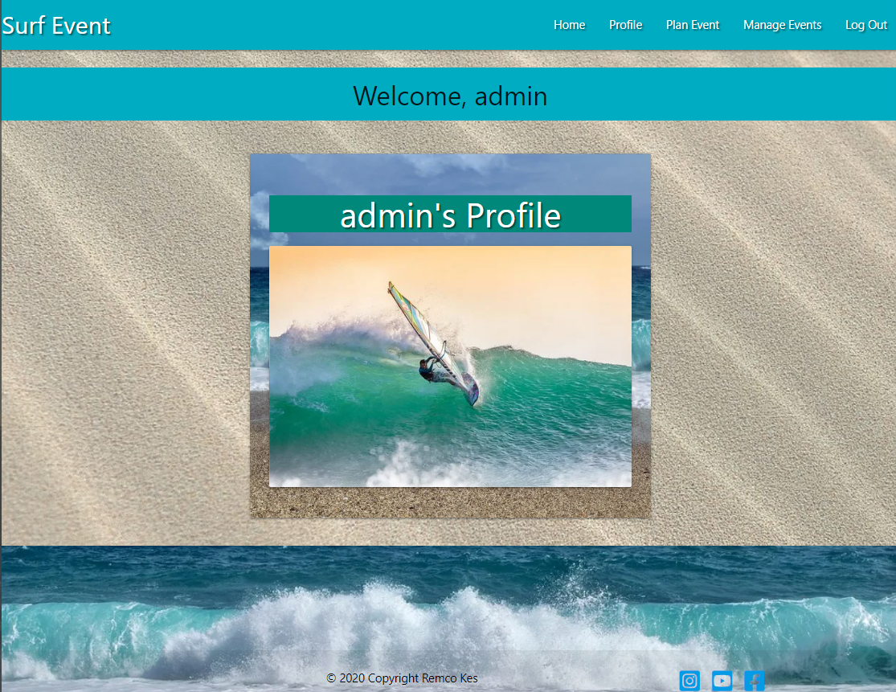

On the manage events page the admin can manage the events by adding, editing or deleting a event.


Only the admin account can add new events.

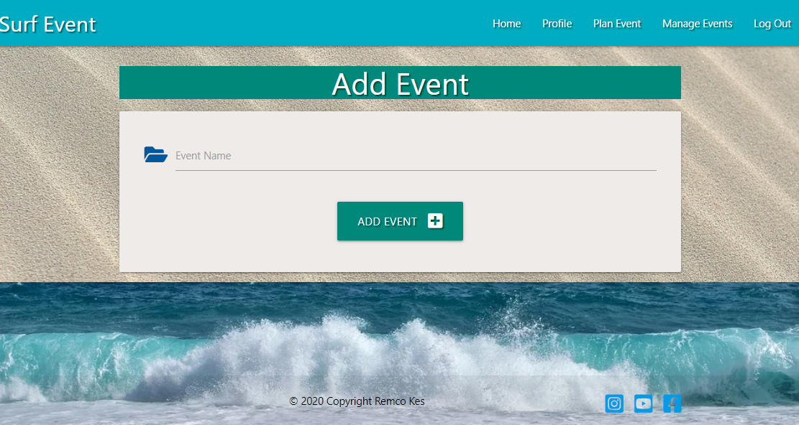

### Skeleton
* Header: Right Aligned Links from [Materialize](https://materializecss.com/)
* Menu: with Mobile Collapse Button on medium and small divices from [Materialize](https://materializecss.com/)
* Footer: from [Materialize](https://materializecss.com/)
* Base: with header, footer and background image
* Homepage/All Registrations: Collapsible element from [Materialize](https://materializecss.com/)
* Register page: Card Panel and Text Input fields from [Materialize](https://materializecss.com/)
* Log In page: Card Panel and Text Input fields from [Materialize](https://materializecss.com/)
* Profile page: Card Panels from [Materialize](https://materializecss.com/). Only for registered/logged in users
* Add Registration page: Card Panel, Text Input fields and Collabsable Select field from [Materialize](https://materializecss.com/). Only for registered/logged in users
* Manage Events page: Card Panel and buttons from [Materialize](https://materializecss.com/). Only for admin account
* Edit Event page: Card Panel, Text Input field from [Materialize](https://materializecss.com/). Only for admin account

Features
-----------------------------------------
##### Existing Features

The site can be used as a guest or as a logged in user, however, some features are only available to logged in users.

Any visitor to the site can view the registered surf events at the home page.

Visitors have the option to create an account. Information required to create an account is Username (which must be unique) and password. This information is stored in the users collection. The Username is stored as plain text but the password is stored in a hashed format.

When a visitor has created an account and logged in, they are given the option to register for a surf event, edit their own registered surf event or delete their registered surf event from the database.

Adding a new surf event is only allowed by the admin user.

A user has the option to edit or delete their own surf event registration.

Database Schema
-----------------------------------------
[MongoDB](https://www.mongodb.com/) was used to create the database for this website and it is hosted by [Atlas](https://www.mongodb.com/cloud/atlas).

In MongoDB i made a database called "windsurf" with 3 collections "events","registrations","users" <br>
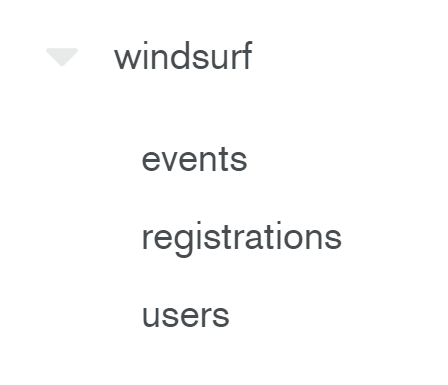

The events are in the collection "events" <br>

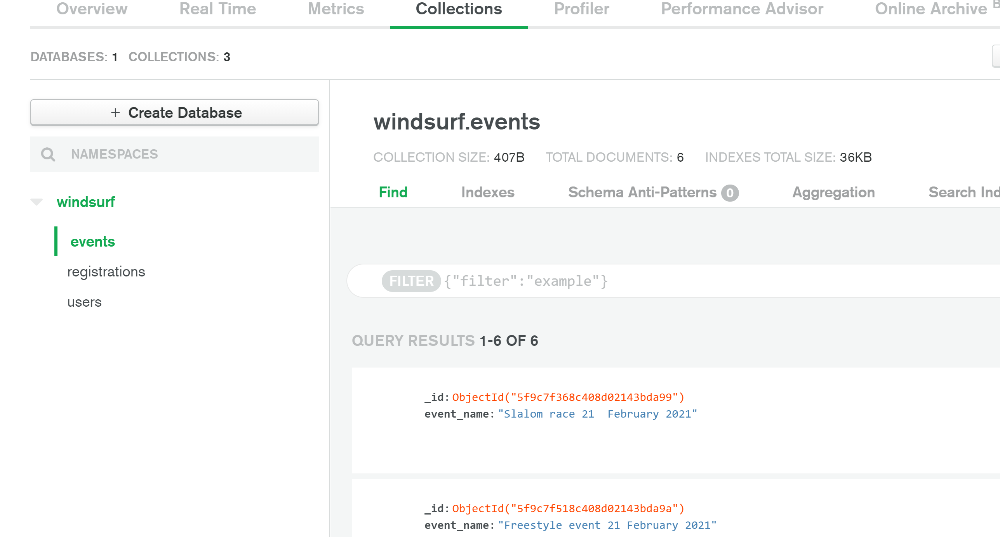

The registrations are in the collection "registration" <br>

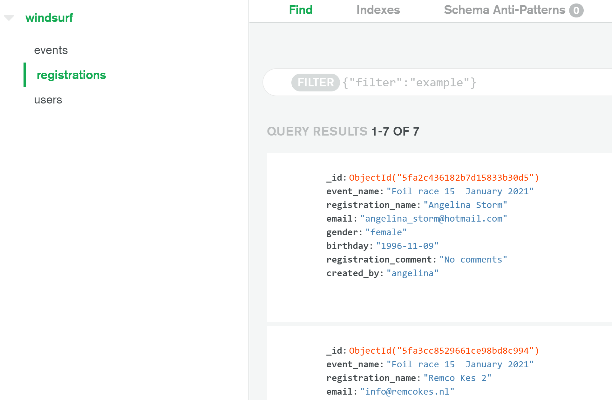

The registered users are in the collection "users" with their hashed password <br>

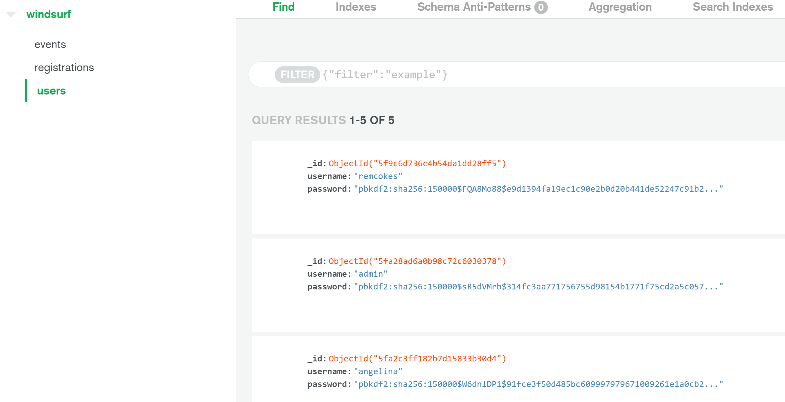

The database schema:

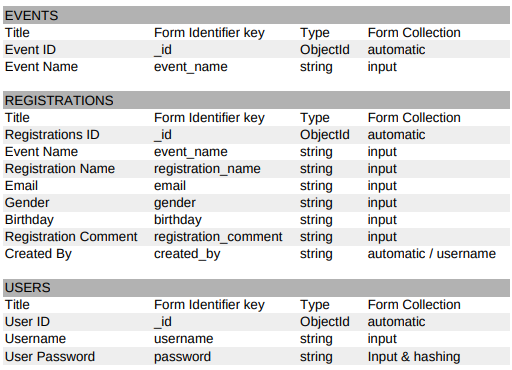

Technologies Used
-----------------------------------------
The website is designed using following technologies:

  * [HTML](https://en.wikipedia.org/wiki/HTML)
  * [CSS](https://en.wikipedia.org/wiki/CSS)
  * [JavaScript](https://en.wikipedia.org/wiki/JavaScript)
  * [Python](https://www.python.org/)
  * [Mongodb](https://www.mongodb.com/)
  * [Jquery](https://code.jquery.com/jquery-3.5.1.js)
  * [Font Awesome library](https://fontawesome.com/)
  * [Materializecss](http://https://materializecss.com/)
  * [dnspython 2.0.0](https://pypi.org/project/dnspython/)
  * [Flask 1.1.2](https://pypi.org/project/Flask/)
  * [Flask_PyMongo 2.3.0](https://pypi.org/project/Flask-PyMongo/)
  * [itsdangerous 1.1.0](https://pypi.org/project/itsdangerous/)
  * [pymongo 3.11.0](https://pypi.org/project/pymongo/)
  * [Werkzeug 1.0.1](https://pypi.org/project/Werkzeug/)


Testing
-----------------------------------------
**Testing:**
Tests were established to verify writing to the database and removing from the database i.e. Adding a user to the database.
Also adding, deleting and editing surf events by admin users. Adding, deleting, editing registered surf events from the database as a registered user.

**Responsiveness Testing:**
Android mobile phone and Apple tablet were used to test the appearance of website on mobile/tablet screen size. 
Also the Google Chrome developer tool where used to test the mobile appearance of the website on different devices. 
   
**User Testing:**

Manual tests were carried out and the testing process was as follows:

**Homepage**
 + Click on logo or Home and verify that home page appears
 + See the on registered events and the pull down menu for the details of the participant of the registered event
 + If visitor is not logged in “Login” should be displayed in the navigation and clicking this link will bring you to the login page
 + If visitor is logged in the navigation should have Home, Profile, Plan Event and Log Out
 + If visitor is logged in you see a "edit" button for editing your own registered event
 + If visitor is logged in you see a in the pull down menu with the details of the participant of the registered event you will see email, gender, birthday, comment and username
 + If visitor is logged in you see a in the pull down menu with the details of the participant of the registered event you have the option to cancel the registration
 + Confirmed that the social links in the footer open in a new browser window and go to the correct links

**Profile**

 + Confirmed that you see the correct username
 + If visitor is logged in the navigation should have Home, Profile, Plan Event and Log Out
 + Confirmed that you see the windsurfing picture
 + Confirmed that the social links in the footer open in a new browser window and go to the correct links
 
 
**Plan Event**
 + Confirmed that you see the option to plan a event
 + Confirmed that you see a event pull down menu where you can choose your event
 + Confirmed that you see an option to register your name
 + Confirmed that you see an option to register your email address
 + Confirmed that you see radio buttons to select your male of female gender
 + Confirmed that you see a birthday picker to select your birthday
 + Confirmed that you see a comment field to give comment

**User Account**

###### Register Page
+ Confirmed that clicking on the log in link brings the user to the log in page
+ All fields are required on the registration form
+ Tested registering successfully and was directed to the profile page as a logged in user with a welcome message
+ Confirmed that username must be unique

###### Login Page
+ Confirm that the register account link brings the user to the register page
+ If user enters an incorrect username then they will receive a error message
+ If user enters a correct username but an incorrect password they will receive a error message 
+ If the user enters the correct login details they are brought to the profile page with a welcome message. You see welcome "username". Navbar changes with the option to Logout

###### Logout
+ Verified that the user is returned to the login page and logged out of the system. 

Deployment
-----------------------------------------
Deployment and source control was carried out via GitHub and Heroku. The repository location is as follows:[https://github.com/remcokes/windsurf_event/](https://github.com/remcokes/windsurf_event/)

Heroku App Location is as follows [http://windsurf-event.herokuapp.com/](http://windsurf-event.herokuapp.com/)

Following steps were taken to deploy the website:
- Database and Tables were created in an Atlas MongoDB 
- Project workspace was created in GitHub
- In the GitHub workspace i make the env.py file to make a secure environment
- 
- In GitHub create a requirements.txt file for Heroku can install the necessary dependencies to run the app. The command used to create the file: pip3 freeze --local > requirements.txt
- In GitHub create a Procfile for Heroku to tell what kind of application it is deploying and how to run. The command used to create the file: echo web: python run.py > Procfile
- Create a free Heroku account
- Create a new app for the project, selecting a name for the app and choose the closest region
- In the Deploy tab choose deployment method GitHub, select your GitHub project
- In the Settings tab choose Reveal Config Vars and put in the same values as in your env.py
- In the Deploy tab choose Enable Automatic Deploys
- Open app
- Don't forget to Set Debug to False

If you close the GitHub repository you need the follow steps:
- touch env.py --. maken your env.py file and fill with this details

- pip3 install -r requirements.txt
- python3 app.py to start the repository again

### Media
The images used on this website were obtained from [Pixabay](https://pixabay.com/). The images are used with the direct html on the page.

### Acknowledgements
* [Slack](https://slack.com/) community
* [Code Institute course](https://codeinstitute.net/) course
* My own 20 years IT knowlegdes

**Contact**

Created by [Remco Kes](mailto:rkes@stadgenoot.nl).
